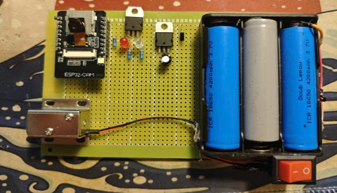
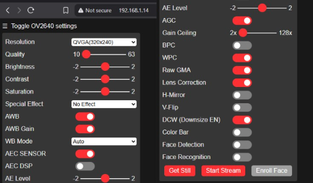
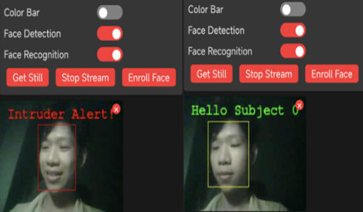

# 🔐 ESP32 Smart Door Lock with Face Recognition

An intelligent door lock system powered by **ESP32-CAM** with real-time face recognition. Automatically unlock doors by recognizing authorized faces through AI-based computer vision.

## ✨ Key Features

- **AI Face Recognition** - Advanced deep learning for accurate face detection and identification
- **Automatic Door Control** - Unlock/lock doors upon recognized face
- **Web Interface** - Access and manage from any web browser
- **WiFi Connectivity** - Remote access via local network
- **Real-time Streaming** - Live video feed from ESP32-CAM
- **Status Indicators** - Red LED (error), Green LED (success)
- **Face Enrollment** - Register new authorized faces easily
- **Safety Timeout** - 6-second delay to prevent continuous opening

## 🔧 Hardware Requirements

| Component | Description |
|-----------|-------------|
| **ESP32-CAM** | Microcontroller with built-in camera (AI Thinker) |
| **Relay Module** | Controls 12V electronic door lock |
| **LEDs** | Red (GPIO 13) & Green (GPIO 14) status indicators |
| **12V Electronic Lock** | Solenoid or electromagnetic lock |
| **TIP122 Transistor** | Relay driver |
| **Power Supply** | 5V USB (ESP32-CAM) + 12V (Lock) |

## 📌 Circuit Connections

```
ESP32-CAM GPIO Mapping:
- GPIO 12 → Relay (through TIP122 transistor)
- GPIO 13 → Red LED (error indicator)
- GPIO 14 → Green LED (success indicator)
- GND → Ground
- 5V → Power (USB)
```

**Full circuit diagram:** See `image/ESP32CAM-LockRecognizeFace.png`

## 🚀 Installation & Setup

### 1. Hardware Assembly
- Connect ESP32-CAM to relay module, LEDs, and electronic lock as per circuit diagram
- Ensure proper power supply (5V for ESP32, 12V for lock)

### 2. Software Setup
- Open `doorlockesp32.ino` in Arduino IDE
- Install ESP32 board support and required libraries:
  - esp_camera
  - face recognition libraries (included in project)
- Configure WiFi credentials in code
- Upload sketch to ESP32-CAM via USB

### 3. First Run
- Power on the system
- Connect to the WiFi SSID broadcast by ESP32
- Open web browser and navigate to ESP32's IP address
- Enroll authorized faces through web interface

## 📷 System Interfaces

### Web Camera Control Panel
- Real-time camera adjustment (resolution, brightness, exposure)
- Face detection and recognition toggle
- Live streaming with quality controls
- Face enrollment for new authorized users

### Face Recognition Display
- **Green border + "Hello Subject"** - Authorized face recognized → Door unlocks
- **Red border + "Intruder Alert"** - Unauthorized face detected → Door stays locked
- Real-time feedback on access attempts

## 📂 Project Structure

```
root/
├── doorlockesp32.ino           # Main Arduino sketch
├── app_httpd.cpp               # HTTP server for web interface
├── camera_index.h              # Web UI (HTML/CSS/JavaScript)
├── camera_pins.h               # ESP32-CAM pin configuration
├── image/                      # Circuit diagrams & documentation images
│   ├── ESP32CAM-LockRecognizeFace.png  # Wiring diagram
│   ├── Picyard_1777346396679.png       # Camera settings interface
│   ├── Picyard_1777346431211.png       # Face recognition interface
│   └── pasted-image.png                # Hardware breadboard setup
└── README.md                   # This file
```

## 🔒 Security Notes

- Change default WiFi credentials after first setup
- Only enroll trusted faces in the system
- Keep firmware updated for security patches
- Test lock mechanism regularly
- Ensure proper power supply to avoid sudden shutdowns

## 📸 Project Demonstration

### Circuit Wiring Diagram


### Hardware Assembly


### Web Interface



## 🛠️ Troubleshooting

**Cannot connect to ESP32 WiFi**
- Check if ESP32 is powered on
- Verify USB cable is properly connected
- Reset ESP32 by pressing reset button

**Face recognition not working**
- Ensure good lighting conditions
- Enroll faces with multiple angles
- Check camera lens is clean
- Verify face is clearly visible in frame

**Door lock not responding**
- Check relay connections
- Verify 12V power supply is working
- Test relay with multimeter
- Check TIP122 transistor connections

## 📝 License

This project is provided as-is for educational and personal use.

## 👤 Author

Project created as a capstone project for embedded systems and AI integration.

---

**GitHub Repository:** [ESP32-SmartLock](https://github.com/ocelot47/ESP32-SmartLock)
