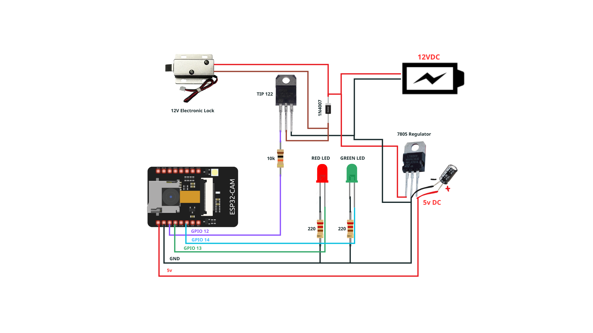

# 🔐 ESP32 Smart Door Lock with Face Recognition

<div align="center">
  


An intelligent door lock system powered by ESP32 with AI-based face recognition. Automatically unlock doors by recognizing authorized faces using real-time computer vision and deep learning technology.

[Features](#-features) • [Hardware](#-hardware-requirements) • [Installation](#-installation) • [Usage](#-usage) • [Troubleshooting](#-troubleshooting) • [Support](#-contact--support)

</div>

---

## 📸 Project Demonstration

### Circuit Diagram & Hardware Setup
**Complete wiring diagram showing ESP32-CAM connections with electronic lock, relay module, status LEDs, and power supply:**



*This diagram shows:*
- *ESP32-CAM microcontroller with integrated camera*
- *GPIO 12 controls the relay for electronic lock activation*
- *GPIO 13 & 14 control status LEDs (Red=Error, Green=Success)*
- *12V DC power supply for electronic lock and relay*
- *5V DC regulator for ESP32-CAM*

### Physical Implementation
**Breadboard prototype showing the actual hardware assembly:**


*The implementation includes:*
- *Relay module for controlling high-power electronic lock*
- *Voltage regulator circuits for stable power*
- *Battery pack for power supply*
- *Compact circuit design on breadboard*

### Web Interface - Camera Settings
**Real-time camera adjustment panel for optimal face detection:**


*Features available:*
- *Resolution settings (QVGA/320x240)*
- *Quality and brightness adjustment*
- *Exposure control (AE Level)*
- *Face Detection & Recognition toggle*
- *Live camera stream with "Get Still" option*
- *Face enrollment for new users*

### Face Recognition System
**Real-time face detection and recognition interface showing authorized vs unauthorized access:**


*Displays:*
- *"Intruder Alert" - When unauthorized face is detected (Red border)*
- *"Hello Subject" - When authorized face is recognized (Green border)*
- *Live feed with face detection box*
- *Control buttons for stream management and enrollment*

---

## ✨ Key Features

- ✅ **AI-Powered Face Recognition**: Advanced deep learning algorithms for accurate face detection and identification
- ✅ **Automatic Door Control**: Seamlessly unlock/lock doors upon recognized face
- ✅ **Web-Based Interface**: Access and manage the system from any web browser
- ✅ **WiFi Connectivity**: Connect to local WiFi network for remote access
- ✅ **Status Indicators**: Red LED for errors, Green LED for successful recognition
- ✅ **Face Enrollment**: Register new authorized faces through web interface
- ✅ **Safety Timeout**: 6-second delay mechanism to prevent continuous door opening
- ✅ **Real-time Streaming**: Live video feed from ESP32-CAM through web interface
- ✅ **Adjustable Camera Settings**: Customize resolution, brightness, exposure, and quality

---

## 🔧 Hardware Requirements

| Component | Description | Connection |
|-----------|-------------|-----------|
| **ESP32-CAM** | Main microcontroller with built-in camera | AI Thinker Module with PSRAM |
| **Relay Module** | Controls electronic door lock | GPIO 12 (through transistor) |
| **Red LED** | Error/unauthorized access indicator | GPIO 13 (with 220Ω resistor) |
| **Green LED** | Success/authorized access indicator | GPIO 14 (with 220Ω resistor) |
| **12V Electronic Lock** | Solenoid or electromagnetic lock | Controlled by relay |
| **TIP122 Transistor** | Relay driver for GPIO-to-relay signal | Base on GPIO 12 |
| **Power Supply** | Dual voltage supply | 5V USB (ESP32-CAM) + 12V (Lock) |
| **USB Cable** | Programming and power | Micro-USB to ESP32-CAM |

---

## 📌 Wiring Diagram

```
ESP32-CAM (GPIO Connections)
├── GPIO 12 ──→ TIP122 Base ──→ Relay Control ──→ 12V Electronic Lock
├── GPIO 13 ──→ Red LED (with 220Ω resistor) ──→ GND
├── GPIO 14 ──→ Green LED (with 220Ω resistor) ──→ GND
├── GND ──────→ Common Ground (All components)
└── 5V ───────→ Power Supply (USB or regulated 5V)

Power Supply
├── 5V DC ────→ ESP32-CAM VCC
├── 12V DC ───→ Electronic Lock (via relay)
└── GND ──────→ Common Ground
```

**Important Notes:**
- Connect GPIO 0 to GND during firmware upload (flashing mode)
- Use 220Ω resistors in series with LEDs for current limiting
- Relay module should be rated for 12V/10A minimum
- Use proper gauge wires to handle relay current (at least 14 AWG for high current)

---

## 🚀 Installation

### Step 1: Prepare Arduino IDE

- Download **Arduino IDE**: [https://www.arduino.cc/](https://www.arduino.cc/)
- Add ESP32 board support:
  - Go to `File` → `Preferences`
  - Paste in Additional Boards Manager URLs: `https://dl.espressif.com/dl/package_esp32_index.json`
  - Open `Tools` → `Board Manager`
  - Search for "esp32" → Install by Espressif Systems

### Step 2: Configure Board Settings

In Arduino IDE, set `Tools` to:

```
Board: "ESP32 Wrover Module"
Upload Speed: "921600"
Flash Frequency: "80MHz"
Flash Mode: "QIO"
Partition Scheme: "Huge APP (3MB No OTA/1MB SPIFFS)"
Core Debug Level: "None"
COM Port: (Select your ESP32's port)
```

### Step 3: Clone and Prepare Code

```bash
# Clone the repository
git clone https://github.com/YOUR_USERNAME/ESP32-SmartLock.git
cd ESP32-SmartLock/doorlockesp32

# Open in Arduino IDE
# File → Open → doorlockesp32.ino
```

### Step 4: Configure WiFi Credentials

Edit `doorlockesp32.ino` and update:

```cpp
const char* ssid = "YOUR_WIFI_SSID";        // Replace with your WiFi name
const char* password = "YOUR_WIFI_PASSWORD"; // Replace with your WiFi password
```

### Step 5: Upload Firmware

**Hardware Setup:**
1. Connect ESP32-CAM to computer via USB cable
2. **Press and hold GPIO 0 button** (or connect GPIO 0 to GND) - this enters flashing mode
3. Press the RESET button on ESP32-CAM board
4. In Arduino IDE, click `Upload`
5. Wait for "Hard resetting via RTS pin..." message

**Troubleshooting Upload:**
- Ensure GPIO 0 is properly connected to GND
- Use a quality USB cable (some cables only charge, not transfer data)
- Try different COM ports if upload fails
- Reduce upload speed to 115200 if having timeout issues

---

## 💡 Usage

### 🌐 Access Web Interface

1. **Check ESP32 IP Address:**
   - Open Serial Monitor in Arduino IDE (Baud Rate: 115200)
   - Look for message: `Camera Ready! Use 'http://192.168.x.x' to connect`
   
2. **Open Web Interface:**
   - Launch your web browser
   - Navigate to: `http://192.168.x.x/` (replace with actual IP)
   
3. **Available Controls:**
   - **Live Stream**: View real-time camera feed
   - **Camera Settings**: Adjust resolution, brightness, exposure
   - **Face Detection**: Toggle face detection on/off
   - **Face Recognition**: Toggle face recognition on/off
   - **Enroll Face**: Register new authorized users
   - **Get Still**: Capture single photo from camera

### 🔓 Unlock Door with Face Recognition

**Normal Operation:**
1. Person stands in front of camera
2. System detects face automatically
3. **If recognized:**
   - Green LED illuminates
   - Door unlocks automatically
   - Lock stays open for 6 seconds
4. **If not recognized:**
   - Red LED illuminates
   - "Intruder Alert" message displays
   - Door remains locked

### 👤 Enroll New Face

**Add Authorized User:**
1. Click "Enroll Face" button in web interface
2. Enter user ID/name (e.g., "John Doe")
3. Position face clearly in camera view
4. System captures 5 different angles automatically (5 confirmations)
5. User is now registered and can unlock door

**Tips for Better Recognition:**
- Ensure adequate lighting (200+ lux recommended)
- Position face directly facing camera
- Minimize background objects
- Avoid wearing sunglasses or hats during enrollment

---

## ⚙️ Advanced Configuration

### Adjust Door Unlock Duration

Edit `doorlockesp32.ino`:

```cpp
int interval = 6000;  // Time in milliseconds (default: 6 seconds)
// Change to desired time (e.g., 10000 for 10 seconds)
```

### Change WiFi Credentials

Edit `doorlockesp32.ino`:

```cpp
const char* ssid = "YourWiFiName";
const char* password = "YourWiFiPassword";
```

### Modify Face Recognition Sensitivity

Edit `app_httpd.cpp` and search for face matching threshold (adjust confidence level 0.0-1.0)

### Add Multiple Users

Simply follow the "Enroll New Face" process for each user. System supports up to 7 registered faces.

---

## 📁 Project Structure

```
doorlockesp32/
├── doorlockesp32.ino          # Main sketch: WiFi setup, GPIO control
├── app_httpd.cpp              # HTTP server, face recognition logic  
├── camera_pins.h              # GPIO configuration for AI Thinker
├── camera_index.h             # Web interface (HTML/CSS/JavaScript)
├── README.md                  # This documentation
├── .gitignore                 # Git ignore patterns
└── images/
    ├── ESP32CAM-LockRecognizeFace.png  # Wiring diagram
    ├── pasted-image.png                # Hardware setup
    ├── Picyard_1777346396679.png       # Camera settings UI
    └── Picyard_1777346431211.png       # Face recognition UI
```

| File | Purpose |
|------|---------|
| **doorlockesp32.ino** | Setup WiFi connection, initialize GPIO pins, control LED/relay timing |
| **app_httpd.cpp** | HTTP server implementation, face detection/recognition algorithms, relay control |
| **camera_pins.h** | GPIO pin definitions for AI Thinker ESP32-CAM module |
| **camera_index.h** | Web interface HTML, CSS, and JavaScript for browser access |

---

## 🐛 Troubleshooting

| Problem | Cause | Solution |
|---------|-------|----------|
| **Cannot upload code** | GPIO 0 not connected to GND | Hold GPIO 0 button while uploading, or connect GPIO 0 to GND permanently |
| **WiFi won't connect** | Wrong SSID or password | Verify WiFi credentials in code, check if network is 2.4GHz (5GHz not supported) |
| **Face not recognized** | Poor lighting or bad angle | Improve lighting, position face directly facing camera, re-enroll face |
| **LEDs not lighting** | GPIO pins incorrectly connected | Check GPIO 13 (Red) and 14 (Green) connections, verify resistors |
| **Door won't unlock** | Relay not activating | Check GPIO 12 connection, verify relay module power and control signal |
| **Web interface not accessible** | Connection issue | Check Serial Monitor for IP address, ensure computer on same WiFi network |
| **ESP32 crashes/resets** | Power supply insufficient | Use proper 5V power adapter, not just USB charging cable |
| **Face enrollment fails** | Insufficient lighting or poor quality | Ensure face is clearly visible, good contrast, adequate illumination |
| **PSRAM error** | Board not configured for PSRAM | Select "ESP32 Wrover Module" with PSRAM in board settings |

---

## 📚 References

- [ESP32 Official Docs](https://docs.espressif.com/projects/esp-idf/en/latest/)
- [Arduino IDE Documentation](https://docs.arduino.cc/)
- [ESP32-CAM Specifications](https://ai-thinker.gitbook.io/esp32-cam/)
- [ESP-WHO (Face Recognition Library)](https://github.com/espressif/esp-who)
- [Apache License 2.0](https://opensource.org/licenses/Apache-2.0)

---

## 📝 License

This project is licensed under the **Apache License 2.0**. See the LICENSE file for details.

```
Copyright 2015-2016 Espressif Systems (Shanghai) PTE LTD
Licensed under the Apache License, Version 2.0 (the "License");
you may not use this file except in compliance with the License.
You may obtain a copy of the License at
    http://www.apache.org/licenses/LICENSE-2.0
```

---

## 🤝 Contributing

Contributions are welcome! To contribute:

1. **Fork** the repository
2. **Create** a feature branch (`git checkout -b feature/YourFeature`)
3. **Commit** changes (`git commit -m 'Add YourFeature'`)
4. **Push** to branch (`git push origin feature/YourFeature`)
5. **Open** a Pull Request

Please ensure your contributions:
- Follow existing code style
- Include comments for complex logic
- Test thoroughly before submitting
- Update documentation as needed

---

## 📞 Contact & Support

- 📧 **Email**: your.email@example.com
- 🐛 **Issues**: [Open an Issue](https://github.com/YOUR_USERNAME/ESP32-SmartLock/issues)
- 💬 **Discussions**: [Start Discussion](https://github.com/YOUR_USERNAME/ESP32-SmartLock/discussions)
- 📖 **Documentation**: See [Wiki](https://github.com/YOUR_USERNAME/ESP32-SmartLock/wiki)

---

## 🎯 Project Goals

This project aims to:
- Demonstrate real-world IoT security implementation
- Provide educational value for embedded systems learning
- Show practical AI application (face recognition)
- Serve as foundation for smart home automation systems

---

## 🔮 Future Enhancements

Planned features:
- [ ] Mobile app for remote access
- [ ] Cloud-based face database
- [ ] Multi-factor authentication
- [ ] Activity logging and alerts
- [ ] Integration with smart home platforms (Home Assistant, etc.)
- [ ] MQTT support for IoT connectivity
- [ ] Machine learning model optimization

---

## ⚠️ Security Notice

**Important:** This is an educational project. For production use:
- Implement HTTPS for web interface
- Add authentication/password protection
- Use encrypted credential storage
- Implement audit logging
- Use secure WiFi (WPA3 recommended)
- Consider additional physical security measures
- Regularly update firmware and libraries

---

<div align="center">

⭐ **If you find this project helpful, please consider giving it a star!** ⭐

Made with ❤️ for IoT and Security Enthusiasts

**[Back to Top](#-esp32-smart-door-lock-with-face-recognition)**

</div>
